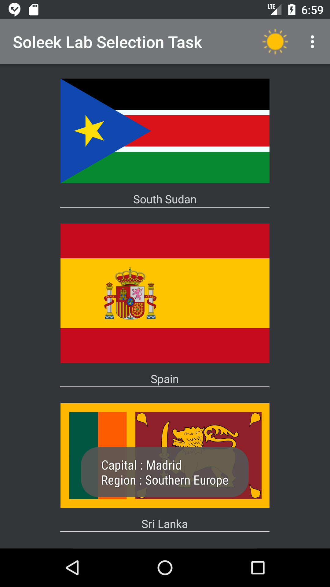

# SoleekLabSelectionTask
A Selection task that is a simple Firebase Authentication app with simple api to view countries on the main screen.

# Screens
## 0 - Splash Screen

## 1 - Login with Firebase Screen

## 2 - Registration with Firebase Screen

## 3 - Main Screen

A Recycler view that display names and flags of each countries, and toasts the capital and the area of each country when it is clicked on.
Also, It has a night mode also for the night mode fans.
